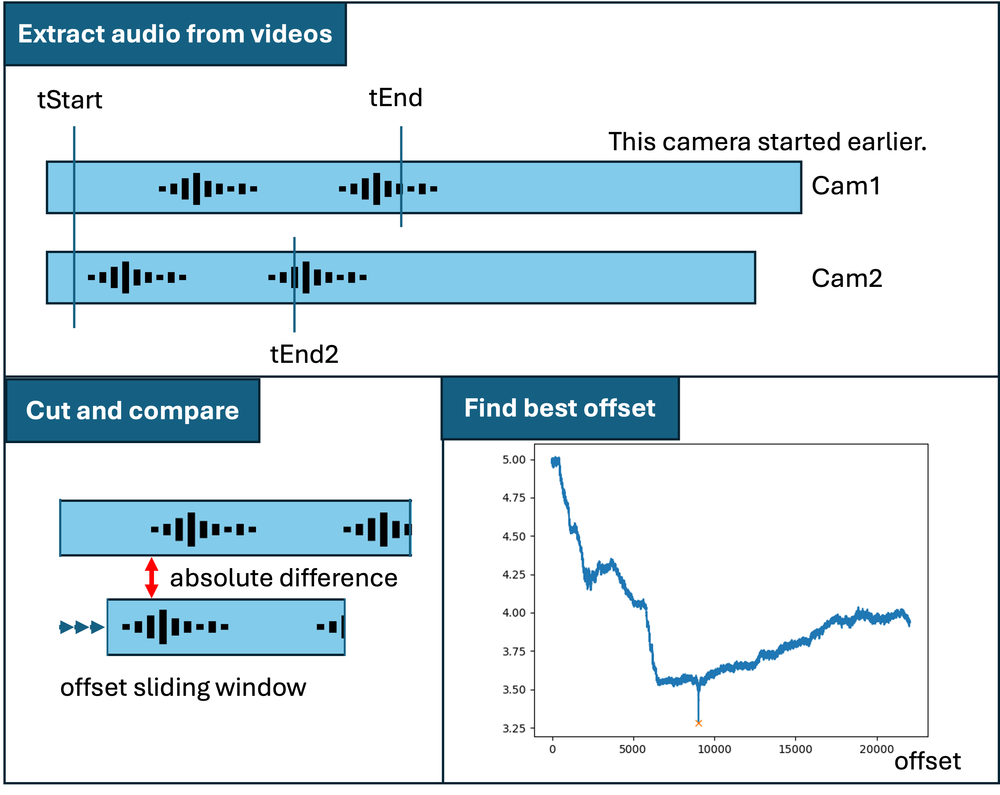

# Temporal synchronization of several GoPros

## Setup

To load the conda environment from the `environment.yml` file, use the following command:

```sh
conda env create -f environment.yml
```

After that, activate the environment.

```sh
conda activate gopro_sync
```

## Method

Several GoPros are started around the same time. It is known which GoPro was started before the others. There is some distinctive audio signal audible in all cameras. With this script, we want to find the temporal offset of each camera to the main camera and pad the beginning with black frames, so that all videos are synchronized afterwards.

Either synchronize all videos in an experiment, or select handpicked cameras to be synchronized. The Jupyter Notebook helps to check after each step.

We use a sliding window approach by sliding the video that starts later over the video that starts earlier and calculating the absolute difference in their mono audio file. The correct offset usually has a negative peak.

<div style="text-align:center;">
    
</div>

What to do if the minimum was not found?
- Play around with the tStart, tEnd and tEnd2 parameters which determine which part of the audio is used for comparison (e.g. the first 200 seconds of the video that starts later, are compared to the first 300 seconds of the video that starts earlier - this means that you expect the offset to happen within the first 100 seconds of the video). If no minimum is visible, maybe you have to extend the end time.
- If the wrong minimum is detected, look for the find_peaks function in the code and adapt the parameters. If you don't delete the files in the end of the code, it is fast to try different parameters and check if that helps to find the minimum.